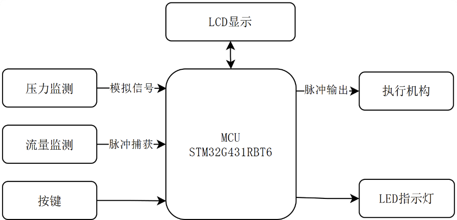
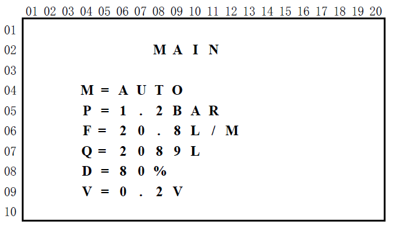
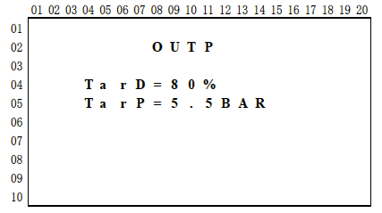
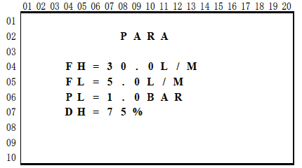
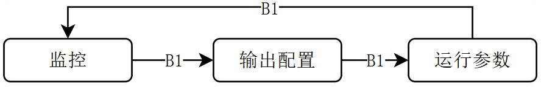
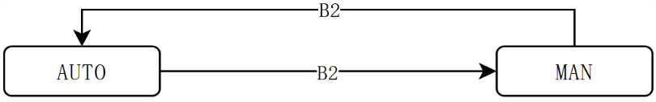
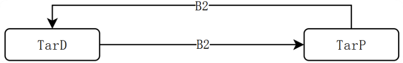
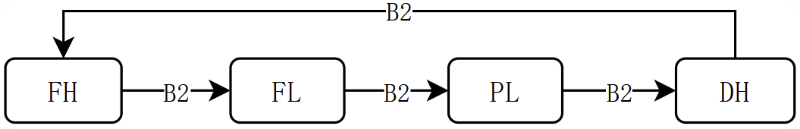

# 第十七届 蓝桥杯（电子类）嵌入式设计与开发项目 省赛

## 第二部分 程序设计试题（85 分）

## 一. 基本要求

1.1 使用大赛组委会提供的四梯嵌入式竞赛实训平台，完成本试题的程序设计与调试。

1.2 参考资料：选手在程序设计与调试过程中，可参考组委会提供的“资源数据包”，禁止使用资源数据包以外的其它参考资料。

1.3 提交要求：程序编写、调试完成后，选手需通过考试系统提交包含其自行编写的最终版本的 `.c`、`.h` 源文件（不包含库文件）和 `.hex` 文件的压缩文件。`.hex` 文件是成绩评审的依据，要求以选手准考证号命名。

注意事项

- 需提交的源文件是指选手工程文件中自行编写或修改过的 `.c` 和 `.h` 文件。资源数据包中原有的选手未修改过的 `.c`、`.h` 源文件和其他文件不需要上传考试系统。`.hex` 文件由 MDK-ARM 集成开发环境编译后生成，选手可以在工程文件相应的输出文件夹中查找。
- 严格按照文件提交与命名要求，不符合以上文件提交要求和命名要求的作品将被评为零分，最终上传的压缩文件大小控制在 `30MB` 以内，格式为 `.zip`、`.rar` 或 `.7z`。

## 二. 硬件配置

请在 `80MHz` 系统主频下完成本试题的全部要求。

系统功能实现限定于硬件框图给出的硬件资源，禁止使用其它资源。



图 1 系统框图

## 三. 功能要求

在工业管路监控场景中，需要实时监测流体的压力与流量。请基于竞赛硬件平台设计一个具备手动调节、总流量累加计量、压力零点校准、输出控制与管路堵塞、泄露风险预警等功能的管路监控设备。

### 3.1 功能概述

1) 电位器模拟压力传感器输出，实现压力实时监测功能。

2) 脉冲信号模拟流量传感器输出，实现流量实时监测功能。

3) 单路可调节 PWM 信号输出，模拟执行机构调速场景。

4) 数据存储与查询功能。

5) 依试题要求，通过按键完成界面切换、参数设置等功能。

### 3.2 性能要求

1) 按键响应时间：≤0.1 秒。

2) 指示灯动作响应时间：≤0.1 秒。

3) 输出信号频率偏差：±2%。

4) 输出信号占空比偏差：±1%。

5) LCD 显示数据刷新时间 0.1 秒，显示效果清晰、稳定，无噪点。

### 3.3 硬件配置

1) 压力监测功能：调节电位器 R37 输出模拟测试信号。

2) 流量监测功能：调节电位器 R39 输出脉冲测试信号。

3) 脉冲输出功能：执行机构的 PWM 控制信号通过 PA1 引脚输出。

### 3.4 压力监测

采集电位器电压并将其线性转换为 `0 ~ 10.0Bar` 的压力数据，对应输入电压范围 `[Voffset, 3.3V]`。支持零点校准功能，`Voffset` 为零点偏置电压，校准后，系统应动态更新映射斜率。

若当前 ADC 采集到的实时电压值小于零点偏置电压 `Voffset`，则压力值取 `0`。

### 3.5 流量监测

1) 瞬时流量（F）

采集脉冲信号频率，瞬时流量按照以下模式计算：

```text
F = f / 200
```

F 为瞬时流量，单位为升/分钟，f 为频率值，单位为 Hz。

合理有效的频率范围：800 - 8000Hz。

若频率 `f < 800Hz`，瞬时流量计为 `0`；若频率 `f > 8000Hz`，瞬时流量计为 `40 升/分钟`，并触发报警功能。

2) 累计流量（Q）

系统以 `100ms` 为采样周期，对瞬时流量进行累加得到累计流量。

当累计流量增量每满 `1L` 时更新当前值，累计流量单位为 `L`。

### 3.6 运行模式与输出控制逻辑

支持通过按键切换手动、自动两种运行模式，控制 PWM 信号输出占空比，占空比可调节范围限制在 `5% - 95%`，输出频率固定为 `10kHz`。

1) 手动模式

支持通过按键直接配置 PWM 输出信号的占空比；配置生效后，占空比需从当前值以 `±1%/秒` 的速率平滑过渡至目标设定值。

2) 自动模式

允许用户设定一个目标压力值 `Ptarget`。若：

- 当前压力 `P < Ptarget - 0.5`，占空比每秒增 `1%`。
- 当前压力 `P > Ptarget + 0.5`，占空比每秒减 `1%`。
- 当前压力 `P` 在 `[Ptarget - 0.5, Ptarget + 0.5]` 区间内，目标达成占空比保持不变。

自动模式下：若占空比已增加到 `95%`，不再增加；已降低至 `5%`，不再减少。

### 3.7 显示功能

1) 监控界面

监控界面显示系统运行关键数据，包括：界面名称（MAIN）、工作模式（M）、实时压力值（P）、瞬时流量（F）、累计流量（Q）、PWM 输出状态（D）和零点偏置电压（V）。



图 2 监控界面

工作模式（M）：自动模式（AUTO）、手动模式（MAN）。

实时压力值（P）：保留小数点后 1 位有效数字，单位为 BAR。

瞬时流量（F）：保留小数点后 1 位有效数字，单位为升每分钟。

累计流量（Q）：整数，单位为升，至少可累加至 999999999 升。

PWM 输出状态（D）：PWM 输出信号占空比的实时值。

零点偏置电压 `Voffset (V)`：保留小数点后 1 位有效数字，单位为伏特。

2) 输出配置界面

输出配置界面下可以设置系统输出状态，包括：输出信号占空比（TarD）和目标压力值（TarP）。



图 3 输出配置界面

在系统运行过程中，TarD 定义手动模式下输出信号的占空比调节目标，TarP 定义自动模式下的压力调节目标。

3) 运行参数界面

系统支持 4 个核心安全参数的设定功能，包括 FH、FL、PL 和 DH，这些参数作为管路泄露、堵塞等异常情况的判定依据。



图 4 运行参数界面

其中 FH、FL 代表两个瞬时流量参数，单位为升每分钟，保留小数点后 1 位有效数字；PL 为压力参数，单位为 BAR，保留小数点后 1 位有效数字，DH 为输出信号占空比参数。

4) LCD 通用显示要求

- 显示背景色（BackColor）：黑色
- 显示前景色（TextColor）：白色
- 数据项与对应的数据之间使用 `=` 间隔开。
- 使用资源数据包中提供的驱动和字库文件，严格按照图示 2、3、4 要求设计各个信息项的名称（区分字母大小写）和行列位置。

### 3.8 按键功能

1) B1：定义为“界面”按键

按下 B1 按键可以往复切换监控、输出配置和运行参数三个界面，切换模式如图 5 所示。



图 5 LCD 界面切换模式

2) B2：定义为“功能”按键。

① 在监控界面下，按下 B2 按键，切换选择手动或自动工作模式。



图 6 工作模式切换

② 在输出配置界面下，按下 B2 按键，切换当前选择的输出配置，切换模式如图 7 所示。



图 7 输出配置切换模式

每次从监控界面进入输出配置界面，默认当前可调整的参数为 TarD。

③ 在运行参数界面下，按下 B2 按键，切换当前选择的运行参数，切换模式如图 8 所示。



图 8 运行参数切换模式

每次从输出配置界面进入运行参数界面，默认当前可调整的参数为 FH。

3) B3：定义为“加”按键

① 在输出配置或运行参数界面下，加按键对当前选择的参数有效，参数调节规则如下：

```text
TarD: +5%；  TarP: +0.5BAR
FH:+1L/MIN； FL:+1L/MIN； PL:+0.5BAR； DH:+10%
```

② 在监控界面下，长按 B3 按键 2 秒后松开按键，触发零点校准功能，即时将当前电压值更新为零点偏置电压。

4) B4：定义为“减”按键

① 在输出配置或运行参数界面下，减按键对当前选择的参数有效，参数调节规则如下：

```text
TarD:-5%；  TarP:-0.5BAR
FH:-1L/MIN； FL:-1L/MIN； PL:-0.5BAR； DH:-10%
```

② 在监控界面下，长按 B4 按键 2 秒后松开按键，触发累计流量清零功能。

按键功能设计要求：

- 输出配置、运行参数在对应界面下的调整均为预设状态（不生效），仅在退出该设置界面时触发全局更新，配置或参数生效。
- 输出配置、运行参数范围如下，调节时应确保取值合理有效：

```text
TarD:5% - 95%
TarP:1.0 - 9.5BAR
FH:4 - 40L/MIN
FL:4 - 40L/MIN
PL:1.0 - 9.5BAR
DH:5% - 95%
```

- 按键应进行有效的防抖处理，避免出现一次按键动作触发多次功能等情形。
- 当前界面下未定义功能的按键按下时，系统保持当前状态且无响应。
- 按键动作不应影响数据采集过程和屏幕显示效果，不改变显示字体前景色和背景色。

### 3.9 LED 指示灯功能

系统通过 LED 指示灯提供运行状态反馈及安全预警，具体逻辑定义如下：

1) LD1 定义为传感器异常报警指示灯，用于判定流量传感器工作状态。

若捕获的脉冲频率大于 8000Hz，判定为传感器工作异常，指示灯点亮；否则，报警自动解除，指示灯熄灭。

2) LD2 定义为管路堵塞预警指示灯，用于判定末端负载异常。

若实时流量 `F < FL` 且当前 PWM 输出占空比 `> DH`，状态持续超过 2 秒，判定为管路堵塞，指示灯点亮；故障排除或状态恢复后，指示灯熄灭。

3) LD3 定义为管路泄漏预警指示灯，用于判定管路密封性。

若实时流量 `F > FH` 且实时压力 `P < PL`，状态持续超过 2 秒，判定为管路泄漏，指示灯点亮；故障恢复后指示灯熄灭。

4) LD4 定义为动态调节指示灯，用于反馈控制系统的过渡过程。

当用户修改设定目标 TarD 或 TarP 且配置生效后，目标达成前 LD4 点亮；当达到目标值后，指示灯熄灭。

5) LD5-LD8 指示灯始终处于熄灭状态。

## 四. 初始状态

请严格按照下列要求设计系统上电后的初始状态和默认参数：

1）处于监控界面

2）工作模式：手动模式（MAN）

3）默认运行参数：FH:20.0L/MIN，FL:10.0L/MIN，PL:1.0BAR，DH:65%

4）默认输出配置：TarD:5%，TarP:5.0BAR

5）零点偏置电压（Voffset）：0.0V

6）累计流量值（Q）：0L

7）PWM 输出状态（D）：5%
